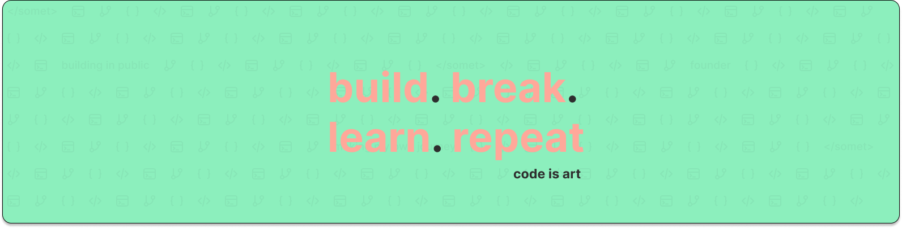

## Hey, I'm Abdulwahab 👋

<!--
**abdul2025/abdul2025** is a ✨ _special_ ✨ repository because its `README.md` (this file) appears on your GitHub profile.

Here are some ideas to get you started:

-->

- 🔭 I’m currently working on Building backends and event-driven systems with Python, DRF, MVC, Docker, and AWS.
- 🌱 I’m currently learning AWS Accosicate Developer and python for ML/AI.
- 👯 I’m looking to collaborate on Backend projects using Django REST Framework (DRF) and AWS native solutions.
- 🤔 I’m looking for help with Python AI/ML and AWS for AI/ML.
- 💬 Ask me about Django, Event drivn development, CI/CD, git, AWS for developer and API integrations.
- 📫 How to reach me: Email
- ⚡ Fun fact: I enjoy solving problems so much that I sometimes create mini ones just to test new solutions.

## 🌐 Socials:
  

# 💻 Tech Stack:
                        
# 📊 GitHub Stats:
 
 

---

<!-- Proudly created with GPRM ( https://gprm.itsvg.in ) -->
